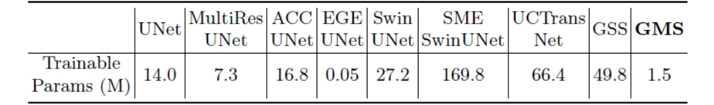
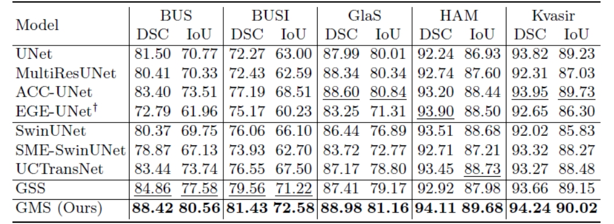
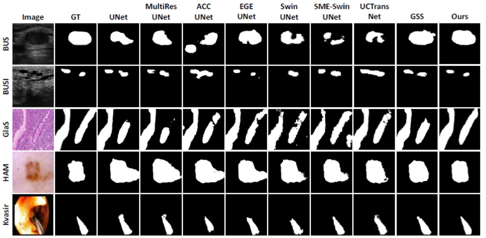
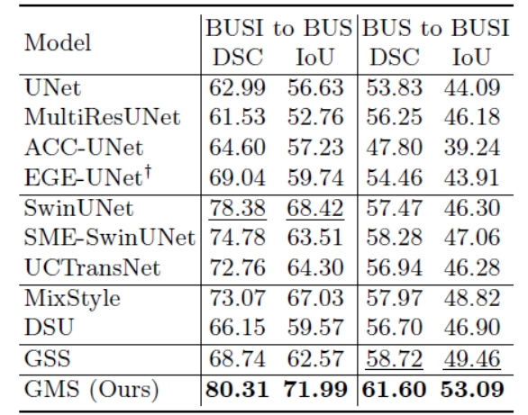

# Generative Medical Segmentation

This is the official repository of Generative Medical Segmentation (GMS).

[Paper](https://arxiv.org/pdf/2403.18198.pdf)

## Introduction
We introduce Generative Medical Segmentation (GMS), a novel approach leveraging a generative model for image segmentation. Concretely, GMS employs a robust pre-trained Variational Autoencoder (VAE) to derive latent representations of both images and masks, followed by a mapping model that learns the transition from image to mask in the latent space. This process culminates in generating a precise segmentation mask within the image space using the pre-trained VAE decoder. The design of GMS leads to fewer learnable parameters in the model, resulting in a reduced computational burden and enhanced generalization capability. Our extensive experimental analysis across five public datasets in different medical imaging domains demonstrates GMS outperforms existing discriminative segmentation models and has remarkable domain generalization.

## Overview of GMS
We use the pre-trained [Stable Diffusion Variational Auto-Encoder](https://github.com/Stability-AI/stablediffusion) to abtain the latent representation of input images and reconstruct the predicted segmentation mask from the latent space. For the reconstruction capability of SD VAE, please check the [supplementary material](https://arxiv.org/pdf/2403.18198.pdf). The latent mapping model was purely developed on CNN, and does not contain down-sampling layers to prevent information loss.


## Trainable Parameters
Since we freeze the SD VAE and only train the latent mapping model, the trainable parameters of GMS are much fewer than other medical image segmentation models. Note that EGE-UNet is a well-designed lightweight model for medical image segmentation.



## Dataset
The performance of GMS was evaluated on five public datasets: [BUS](http://www2.docm.mmu.ac.uk/STAFF/M.Yap/dataset.php), [BUSI](https://scholar.cu.edu.eg/?q=afahmy/pages/dataset), [GlaS](https://warwick.ac.uk/fac/cross_fac/tia/data/glascontest/), [HAM10000](https://dataverse.harvard.edu/dataset.xhtml?persistentId=doi:10.7910/DVN/DBW86T) and [Kvasir-Instrument](https://datasets.simula.no/kvasir-instrument/)

## Quantitative Segmentation Results
Quantitative performance on different datasets compared to other models. Best and second-best performances are bold and underlined, respectively. $^\dagger$ indicates fewer trainable parameters than GMS.



## Visualization Results



## Cross-domain Segmentation Results
We were surprised to find that the intrinsic domain generalization ability of GMS is much powerful than other segmentation models, even better than some methods (MixStyle and DSU) that were designed for the domain generalization problem.




## Citation
If you use this code for your research, please consider citing our paper.
```
@article{huo2024generative,
  title={Generative Medical Segmentation},
  author={Huo, Jiayu and Ouyang, Xi and Ourselin, S{\'e}bastien and Sparks, Rachel},
  journal={arXiv preprint arXiv:2403.18198},
  year={2024}
}
```

## Acknowledgments
Thanks for the following code repositories: [Stabled Diffusion](https://github.com/Stability-AI/stablediffusion) and [GSS](https://github.com/fudan-zvg/GSS)

