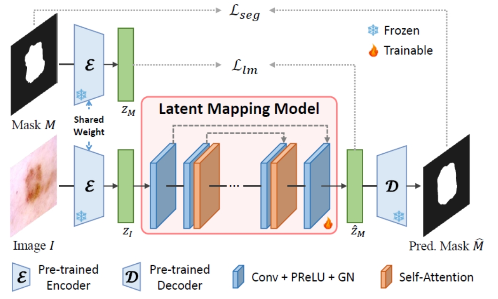

# Generative Medical Segmentation

This is the official repository of Generative Medical Segmentation (GMS).

[Paper](https://arxiv.org/pdf/2403.18198.pdf) | [Weights](ckpt)

## Updates
- **2024.12.09**: Our work was accepted by AAAI 2025.
- **2024.05.13**: Code and model weights have been released.

## Introduction
We introduce Generative Medical Segmentation (GMS), a novel approach leveraging a generative model for image segmentation. Concretely, GMS employs a robust pre-trained Variational Autoencoder (VAE) to derive latent representations of both images and masks, followed by a mapping model that learns the transition from image to mask in the latent space. This process culminates in generating a precise segmentation mask within the image space using the pre-trained VAE decoder. The design of GMS leads to fewer learnable parameters in the model, resulting in a reduced computational burden and enhanced generalization capability. Our extensive experimental analysis across five public datasets in different medical imaging domains demonstrates GMS outperforms existing discriminative segmentation models and has remarkable domain generalization.

## Overview of GMS
We use the pre-trained [Stable Diffusion Variational Auto-Encoder](https://github.com/Stability-AI/stablediffusion) to abtain the latent representation of input images and reconstruct the predicted segmentation mask from the latent space. For the reconstruction capability of SD VAE, please check the [supplementary material](https://arxiv.org/pdf/2403.18198.pdf). The latent mapping model was purely developed on CNN, and does not contain down-sampling layers to prevent information loss.



## Getting Started
### Environment Setup
We provide a [conda env file](environment.yaml) that contains all the required dependencies. You can use it to create and activate a conda environment.
```
conda env create -f environment.yaml
conda activate GMS
```
Or use the virtual environment:
```
python3 -m venv GMS
source GMS/bin/activate
pip install -r requirements.txt
```

### Prepare datasets
We evaluate GMS on five public datasets: [BUS](http://www2.docm.mmu.ac.uk/STAFF/M.Yap/dataset.php), [BUSI](https://scholar.cu.edu.eg/?q=afahmy/pages/dataset), [GlaS](https://warwick.ac.uk/fac/cross_fac/tia/data/glascontest/), [HAM10000](https://dataverse.harvard.edu/dataset.xhtml?persistentId=doi:10.7910/DVN/DBW86T) and [Kvasir-Instrument](https://datasets.simula.no/kvasir-instrument/). The structure of the Dataset folder should be as follows:
```
Dataset/
├── bus
│   ├── bus_train_test_names.pkl
│   ├── images
│   │   ├── 000001.png
│   │   ...
│   │   └── 000310.png
│   └── masks
│       ├── 000001.png
│       ...
│       └── 000310.png
├── busi
│   ├── busi_train_test_names.pkl
│   ├── images
│   │   ├── benign_100.png
│   │   ...
│   │   └── normal_9.png
│   └── masks
│       ├── benign_100.png
│       ...
│       └── normal_9.png
├── glas
│   ├── glas_train_test_names.pkl
│   ├── images
│   │   ├── testA_10.png
│   │   ...
│   │   └── train_9.png
│   └── masks
│       ├── testA_10.png
│       ...
│       └── train_9.png
├── ham10000
│   ├── ham10000_train_test_names.pkl
│   ├── images
│   │   ├── ISIC_0024306.png
│   │   ...
│   │   └── ISIC_0034320.png
│   └── masks
│       ├── ISIC_0024306.png
│       ...
│       └── ISIC_0034320.png
├── kvasir-instrument
│   ├── kvasir_train_test_names.pkl
│   ├── images
│   │   ├── ckcu8ty6z00003b5yzfaezbs5.png
│   │   ...
│   │   └── ckd4kgex0000h3b5yhpwjd11l.png
│   └── masks
│       ├── ckcu8ty6z00003b5yzfaezbs5.png
│       ...
│       └── ckd4kgex0000h3b5yhpwjd11l.png
└── show_pkl.py
```
We provide the preprocessed **BUSI** and **Kvasir-Instrument** via [this link](https://emckclac-my.sharepoint.com/:f:/g/personal/k21066681_kcl_ac_uk/EmKNDZjEtg9EuBygBDyz4wIBKODtGJhzG2xdIy_NLf4VEA?e=whggsd), please download the dataset file and unzip it into the Dataset folder. For other datasets, please download them via the dataset websites and organize as the same structure. The `.pkl` file stores the train and test spilt for each dataset, you can run [`show_pkl.py`](Dataset/show_pkl.py) to show the content for each pkl file.

### Download the pre-trained SD VAE weight
We provide the pre-trained SD VAE weight via [this link](https://emckclac-my.sharepoint.com/:u:/g/personal/k21066681_kcl_ac_uk/Ec2i-a5vPllGi6_Gkw1KMdkBdv7D7spgVNMPqVE9QI6yOg?e=k1t11h), please download and place it in [`SD-VAE-weights`](SD-VAE-weights) folder.

### Model Inference
We provide model weights for five dataset at [`ckpt`](ckpt) folder. Once all datasets are preprocessed, please run the following command for model inference:
```
sh valid.sh
```

The DSC, IOU, and predicted masks will be automatically saved.

### Model training
Please run the following command for model training:
```
sh train.sh
```

To change hyper-parameters (batchsize, learning rate, training epochs, etc.), please refer to the dataset training yaml file (e.g. [BUSI training yaml](configs/busi_train.yaml)). We train GMS on an NVIDIA A100 40G GPU with the batchsize set to 8. If you encounter the OOM problem, please try to decrease the batchsize. 

## Citation
If you use this code for your research, please consider citing our paper.
```
@article{huo2024generative,
  title={Generative Medical Segmentation},
  author={Huo, Jiayu and Ouyang, Xi and Ourselin, S{\'e}bastien and Sparks, Rachel},
  journal={arXiv preprint arXiv:2403.18198},
  year={2024}
}
```

## Acknowledgments
Thanks for the following code repositories: [Stabled Diffusion](https://github.com/Stability-AI/stablediffusion) and [GSS](https://github.com/fudan-zvg/GSS)

